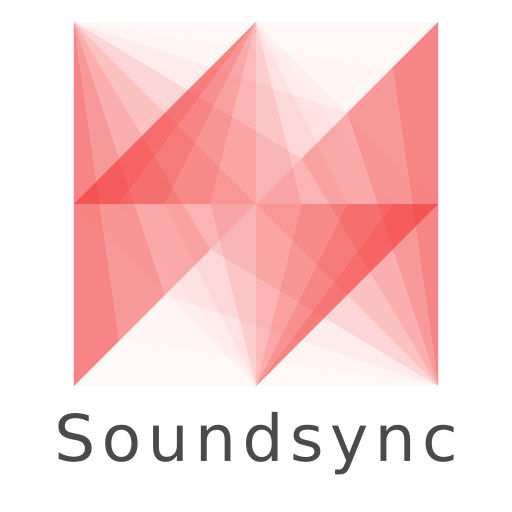
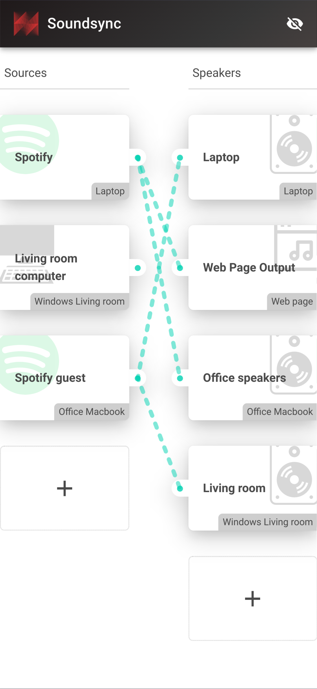
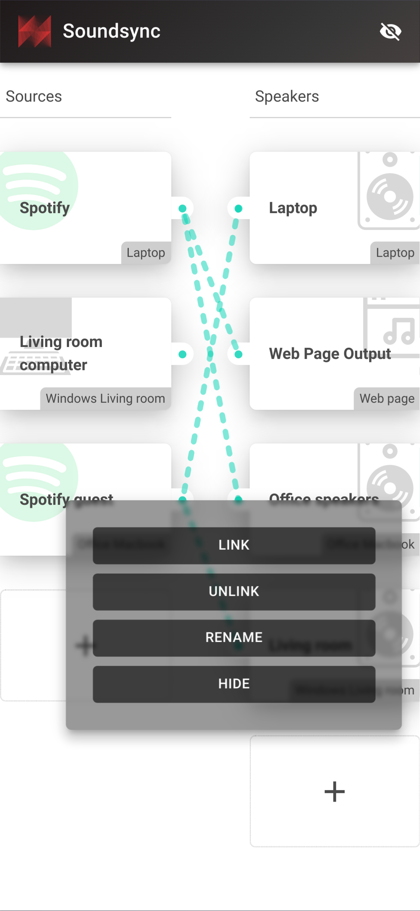

<p align="center">
  
</p>

## Connect virtual cables between any audio source and any audio output

Soundsync is a web and desktop app to manage every audio source and every audio output in your home from a single interface. Link any audio source to multiple speakers connected to any computers on your home network. Soundsync will keep the music synchronized between all of them.

- 🆓 Free to use
- 🕸️ Work with any number of connected devices, audio sources, audio outputs and every link of your choosing
- 🎶 Compatible with a lot of different audio sources (Spotify Connect with a premium account, Windows system audio ; coming soon: Airplay, UPnP)
- 🔊 Broadcast sound to any speaker connected to a computer (Windows, MacOS, Linux, RapsberryPi) or a web browser (Chrome only) and soon Chromecast and more
- 🔗 Group speakers together to synchronize them to the same audio source
- 🎛️ Control everything from a web browser
- 🔓 Not linked to any external service, works offline, no account creation

<p align="center">
  
  
</p>

<!-- ## Download it

<table width="100%" align="center"><tr>
  <td>
    <h3>Windows</h3>
  </td>
  <td>
    <h3>MacOS</h3>
  </td>
  <td>
    <h3>Linux</h3>
  </td>
  <td>
    <h3>Raspberry</h3>
  </td>
</tr></table> -->

## Project status

Soundsync is still in an early stage. It's evolving quickly but there is still a lot to do. Here are some features that are being considered:

- Bluetooth on linux
- Airplay: Shairport-sync
- UPnP: gmrender-resurrect
- Sink volume with libsoundio
- Reconnection when registered with IP instead of Bonjour
- Setting for Spotify sink in Webui
- Initiate WebRTC connection between peers from a web server with an Auth Token as an alternative to Bonjour and to prevent issue with AudioWorklet not being available on http pages
- Allow changing the name of a peer from the webui
- Group of sinks
- Use [waveform-data](https://www.npmjs.com/package/waveform-data) to show activity on webui
- Integration media info on webui
- Synchronize sound with Philips Hue light bulbs
- Create a ready to use RaspberryPi image

## FAQ

- *Is it Open-source ?* Soundsync code is released under the Business Source License. It is not open-source but free to use as long as you don't use it for production work. It means you can use it at home, in your office but you cannot resell it or sell a service/product that directly use it. If you have special needs, [contact me](mailto:guillaume@besson.co) for a licence.

## Development

### Building opus

```
git submodule update --init --recursive
cd src/utils/opus_vendor
./autogen.sh
emconfigure ./configure --disable-extra-programs --disable-doc --disable-intrinsics --disable-hardening --disable-rtcd --disable-stack-protector
emmake make
cd ../
emcc -o opus_wasm.js -s EXPORT_ES6=1 -s MODULARIZE=1 -s SINGLE_FILE=1 -s EXPORT_NAME="Opus" -s USE_ES6_IMPORT_META=0 -s FILESYSTEM=0 -s EXPORTED_RUNTIME_METHODS="['setValue', 'getValue', 'AsciiToString']" -s EXPORTED_FUNCTIONS="['_malloc', '_free', '_opus_decoder_create','_opus_decode_float','_opus_decoder_destroy','_opus_encoder_create','_opus_encoder_destroy','_opus_encode','_opus_strerror']" -s ENVIRONMENT=node,web ./opus_vendor/.libs/libopus.a
```

## Attributions

- Speaker by Mestman from the Noun Project
- Slashed zero by Rflor from the Noun Project
- web browser by Iconstock from the Noun Project
- Computer by iconcheese from the Noun Project
